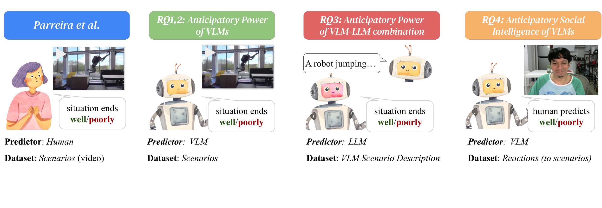

# Bad Idea or Good Prediction? Comparing VLM and Human Anticipatory Judgment

**Authors:** [To be filled]

**Published in:** [To be filled]

---

## Overview

Anticipating outcomes of everyday scenarios is crucial for robots operating in human environments. This study evaluates the anticipatory reasoning capabilities of state-of-the-art Vision Language Models (VLMs) by showing them videos of human and robot scenarios with outcomes removed, then asking them to predict whether the situation will end well or poorly.

## Abstract

We tested multiple VLMs, including closed-source, open-source, and VLM-LLM combinations, using various prompts and compared their predictions against both true outcomes and judgments from 29 human participants. The best-performing VLM configuration achieved **70.0% accuracy** in predicting true outcomes, outperforming the average individual human (62.1% ± 6.2%), while other configurations ranged from 43.3% to 60.0%.

Alignment with individual human judgments ranged from 44.4% to 69.7%. Prompt engineering significantly impacted performance, with variations up to 6.7% within the same model. Notably, VLMs struggled to predict outcomes by analyzing human facial reactions, achieving only 48% accuracy, suggesting limitations in leveraging social cues.

## Research Questions

We investigate anticipatory judgment across four dimensions:

- **RQ1:** What is the anticipatory judgement of **closed-source VLMs** (predicting outcomes on scenario videos)?
- **RQ2:** What is the anticipatory judgement of **open-source VLMs** (predicting outcomes on scenario videos)?
- **RQ3:** What is the anticipatory judgement given a **VLM-LLM combination**?
- **RQ4:** What is the anticipatory social intelligence of closed-source VLMs (predicting outcomes based on human reactions)?

## Dataset

### Video Scenarios
We used 30 videos from the "Bad Idea?" study ([Parreira et al., 2024](https://github.com/IRL-CT/badidea)), featuring scenarios where humans and robots are shown before outcomes are revealed. Videos include everyday situations with both good and bad outcomes.

<table>
<tr>
<td width="50%">

<i>Example: Hoverboard scenario</i>

</td>
<td width="50%">

<i>Example: Robot scenario</i>

</td>
</tr>
</table>

### Human Participants
29 participants from an online study provided baseline human judgments. After watching each video (stopped before resolution), participants predicted whether the situation would end "well" or "poorly."

## Methods

### Models Tested

**Closed-Source VLMs (RQ1):**
- GPT-4o
- Gemini 2.0 Flash
- Qwen-2.5-vl-72b

**Open-Source VLMs (RQ2):**
- LLaMA 3.2 Vision
- LLaVA (multiple variants)
- DeepSeek-OCR
- Gemma 3
- Qwen 2.5 & Qwen 3
- Mistral Small 3.2 (Pixtral)

Open-source models were deployed locally using [Ollama](https://ollama.com/).

**VLM-LLM Combinations (RQ3):**
Two-stage pipeline using Gemini 2.0 Flash for both stages:
1. VLM generates text descriptions of video scenarios
2. LLM predicts outcomes from the descriptions

### Prompts

**For Direct Outcome Prediction (RQ1, RQ2):**

- **Prompt A (Direct):** "Given the scenario shown on the video, you think this situation ends well or poorly? (Use only one word to answer)"

- **Prompt B (Human-like):** "Given the scenario shown on the video, you think this situation ends well or poorly as if you are a human watching the video? (Use only one word to answer)"

**For VLM-LLM Combinations (RQ3):**

- **Prompt C (Descriptive):** "Output a sentence describing what's going on in the video, keeping only key elements of the scenario shown that would allow me to predict the outcome of the situation."

- **Prompt D:** Two variants for outcome prediction from text descriptions

**For Social Intelligence (RQ4):**

- **Prompt E (Reaction-based):** "Given the human reaction shown in the image, do you think the situation observed by that human ends well or poorly? (Use only one word – well or poorly – to answer)"

### Frame Aggregation

Since many VLMs process images rather than video, we extracted frames and tested two aggregation methods:
- **MODE:** Most frequent prediction across all frames
- **LAST:** Prediction from the final frame

### Evaluation Metrics

- **Ground Truth Alignment:** Model predictions vs. actual video outcomes
- **Human Alignment:** Model predictions vs. individual human judgments
- **Metrics:** Accuracy, Precision, Recall, F1-score, and "Poorly" prediction ratio

## Results

### RQ1: Closed-Source VLM Performance

| Model | Accuracy | Precision | Recall | F1 | Poorly Ratio |
|-------|----------|-----------|--------|-----|--------------|
| **Gemini (Prompt A)** | **0.700** | **0.625** | **0.769** | **0.690** | 0.467 |
| Gemini (Prompt B) | 0.633 | 0.562 | 0.692 | 0.621 | 0.467 |
| Qwen (Prompt B) | 0.533 | 0.476 | 0.769 | 0.588 | 0.300 |
| Qwen (Prompt A) | 0.500 | 0.450 | 0.692 | 0.545 | 0.333 |
| GPT-4o (Prompt B) | 0.467 | 0.400 | 0.462 | 0.429 | 0.500 |
| GPT-4o (Prompt A) | 0.433 | 0.375 | 0.462 | 0.414 | 0.467 |
| **Human Average** | **0.621 ± 0.062** | **0.575 ± 0.086** | **0.599 ± 0.091** | **0.579 ± 0.056** | — |

**Key Findings:**
- **Gemini 2.0 Flash (Prompt A)** achieved the highest accuracy (70.0%), outperforming average human performance
- Prompt engineering significantly impacted performance (up to 6.7% difference within same model)
- GPT-4o underperformed relative to other closed-source models

**Alignment with Individual Humans:**

| Model | Accuracy | Precision | Recall | F1 |
|-------|----------|-----------|--------|-----|
| Gemini (Prompt A) | 0.697 ± 0.070 | 0.651 ± 0.129 | 0.755 ± 0.076 | 0.691 ± 0.087 |
| Gemini (Prompt B) | 0.692 ± 0.069 | 0.647 ± 0.130 | 0.750 ± 0.074 | 0.686 ± 0.087 |
| Qwen (Prompt B) | 0.639 ± 0.087 | 0.574 ± 0.119 | 0.871 ± 0.077 | 0.684 ± 0.095 |
| Qwen (Prompt A) | 0.605 ± 0.087 | 0.553 ± 0.125 | 0.794 ± 0.071 | 0.644 ± 0.101 |
| GPT-4o (Prompt A) | 0.489 ± 0.076 | 0.457 ± 0.126 | 0.522 ± 0.091 | 0.482 ± 0.105 |
| GPT-4o (Prompt B) | 0.444 ± 0.072 | 0.408 ± 0.102 | 0.440 ± 0.074 | 0.418 ± 0.082 |

### RQ2: Open-Source VLM Performance

| Model | Accuracy | Precision | Recall | F1 | Method |
|-------|----------|-----------|--------|-----|--------|
| LLaVA-LLaMA 3 | 0.533 | 0.400 | 0.154 | 0.222 | MODE |
| Qwen 2.5 | 0.533 | 0.462 | 0.462 | 0.462 | LAST |
| DeepSeek-OCR | 0.500 | 0.250 | 0.077 | 0.118 | MODE |
| Qwen 3 | 0.467 | 0.286 | 0.154 | 0.200 | MODE |
| **Best Open-Source** | **0.533** | **—** | **—** | **—** | **—** |
| **Best Closed-Source** | **0.700** | **—** | **—** | **—** | **—** |

**Key Findings:**
- Open-source models underperformed closed-source alternatives (53.3% vs. 70.0% at best)
- Several models exhibited severe prediction bias (predicting "poorly" for nearly all scenarios)
- Frame aggregation method (MODE vs. LAST) impacted performance differently across models
- All open-source models remained below human-level performance

### RQ3: VLM-LLM Combination Performance

| Model | Accuracy | Precision | Recall | F1 |
|-------|----------|-----------|--------|-----|
| Gemini 2.0 (Direct) | 0.600 | 0.545 | 0.462 | 0.500 |
| Gemini 2.0 (Descriptive) | 0.500 | 0.458 | 0.846 | 0.595 |

**Key Findings:**
- Two-stage approach achieved 60.0% accuracy (below best end-to-end VLM at 70.0%)
- Generating explicit text descriptions before prediction did not improve performance
- LAST frame aggregation consistently outperformed MODE in VLM-LLM pipeline
- Decomposing task into description + prediction did not bridge anticipatory reasoning gap

### RQ4: Anticipatory Social Intelligence

VLMs analyzed human facial reactions to predict outcomes:

| Model | Window | Accuracy | F1 | Poorly Ratio |
|-------|--------|----------|-----|--------------|
| DeepSeek-OCR | 1s | 0.535 | 0.000 | 0.000 |
| Qwen 3 | 1s | **0.479** | **0.524** | 0.630 |
| LLaMA 3.2 Vision | 3s | 0.478 | 0.606 | 0.848 |
| LLaVA | 3s | 0.481 | 0.649 | 1.000 |

**Key Findings:**
- VLMs performed poorly at predicting outcomes from human reactions (best: 48% accuracy vs. 62% human self-agreement)
- Many models exhibited extreme prediction bias (poorly ratio near 0.0 or 1.0)
- No significant performance difference between 1-second and 3-second temporal windows
- Current VLMs show fundamental limitations in leveraging social cues for anticipatory reasoning

## Discussion

### Main Takeaways

1. **Some VLMs can exceed human performance:** Gemini 2.0 Flash achieved 70.0% accuracy compared to 62.1% average human performance, demonstrating that current state-of-the-art VLMs show promise for anticipatory reasoning tasks.

2. **High sensitivity to model and prompt selection:** Performance varied by up to 23.4 percentage points across different models and prompts, indicating that anticipatory reasoning capabilities are fragile and highly dependent on specific configurations.

3. **Open-source models lag behind:** The best open-source model (53.3% accuracy) performed 17 percentage points below the best closed-source model, with several exhibiting severe prediction biases.

4. **Limitations in social intelligence:** VLMs struggled substantially when predicting outcomes from human facial reactions (48% accuracy), suggesting fundamental limitations in interpreting social cues and emotional expressions.

5. **Prompt engineering matters:** Variations of up to 6.7% within the same model highlight the importance of careful prompt design for anticipatory reasoning tasks.

### Implications for Human-Robot Interaction

- VLMs show potential for proactive error prevention in robots, though performance is highly model-dependent
- Current limitations in social intelligence may constrain applications requiring interpretation of human emotional states
- Careful model selection and prompt engineering are critical for safety-sensitive applications

### Limitations

- Small dataset (30 videos) limits generalizability
- Limited selection of models and prompts tested
- Binary outcome framing (well/poorly) oversimplifies real-world complexity
- Rapid VLM development means findings may become outdated quickly
- Frame aggregation strategies were limited to MODE and LAST

## Repository

Dataset and study materials from Parreira et al.: https://github.com/IRL-CT/badidea

## References

[1] A. Bremers, M. T. Parreira, X. Fang, N. Friedman, A. Ramirez-Aristizabal, A. Pabst, M. Spasojevic, M. Kuniavsky, and W. Ju. The bystander affect detection (bad) dataset for failure detection in hri, 2023.

[2] S. Liu, J. Zhang, R. X. Gao, X. Vincent Wang, and L. Wang. Vision-language model-driven scene understanding and robotic object manipulation. In 2024 IEEE 20th International Conference on Automation Science and Engineering (CASE), pages 21–26, 2024.

[3] M. T. Parreira, S. G. Lingaraju, A. Ramirez-Artistizabal, A. Bremers, M. Saha, M. Kuniavsky, and W. Ju. "bad idea, right?" exploring anticipatory human reactions for outcome prediction in hri. In 2024 33rd IEEE International Conference on Robot and Human Interactive Communication (ROMAN), pages 2072–2078, 2024.

[4] K. Sasabuchi, N. Wake, A. Kanehira, J. Takamatsu, and K. Ikeuchi. Agreeing to interact in human-robot interaction using large language models and vision language models, 2025.
