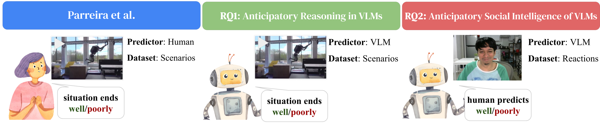
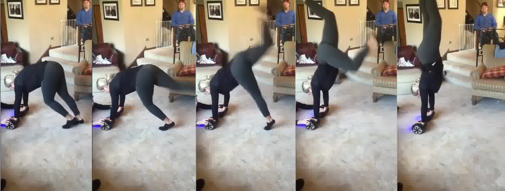
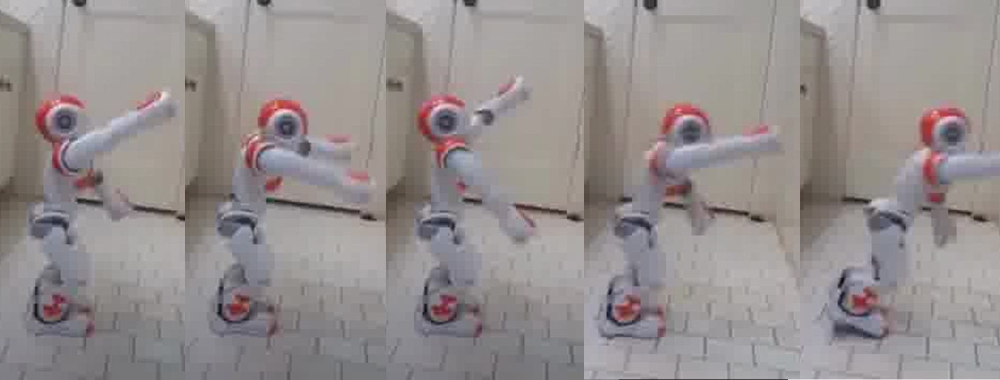

# Bad Idea or Good Prediction? Comparing VLM and Human Anticipatory Judgment

**Authors:** [To be filled]

**Published in:** [To be filled]

---

## Overview

Anticipating outcomes of everyday scenarios is crucial for robots operating in human environments. This study evaluates the anticipatory reasoning capabilities of state-of-the-art Vision Language Models (VLMs) by showing them videos of human and robot scenarios with outcomes removed, then asking them to predict whether the situation will end well or poorly.

## Abstract

This exploratory study evaluates whether Vision Language Models (VLMs) possess anticipatory reasoning capabilities through two complementary approaches. First, we test VLMs on direct outcome prediction by inputting videos of human and robot scenarios with outcomes removed. Second, we evaluate anticipatory social intelligence: can VLMs predict outcomes by analyzing human facial reactions of people watching these scenarios?

We tested multiple VLMs, including closed-source and open-source models, using various prompts and compared their predictions against both true outcomes and judgments from 29 human participants. The best-performing VLM (Gemini 2.0 Flash) achieved **70.0% accuracy** in predicting true outcomes, outperforming the average individual human (62.1% ± 6.2%). Agreement with individual human judgments ranged from 44.4% to 69.7%.

Critically, VLMs struggled to predict outcomes by analyzing human facial reactions, suggesting limitations in leveraging social cues for anticipatory reasoning. These preliminary findings indicate that while some VLMs show promise, their performance is sensitive to model selection and prompt design, with current limitations in social intelligence that warrant further investigation for human-robot interaction applications.

## Research Questions

We investigate anticipatory reasoning through two complementary approaches:

- **RQ1:** What are the anticipatory reasoning capabilities of VLMs (i.e., predicting outcomes on the scenario dataset)?
- **RQ2:** What is the anticipatory social intelligence of VLMs (i.e., predicting anticipated outcomes based on human facial reactions)?

## Dataset

### Video Scenarios
We used 30 videos from the "Bad Idea?" study ([Parreira et al., 2024](https://github.com/IRL-CT/badidea)), featuring scenarios where humans and robots are shown before outcomes are revealed. Videos include everyday situations with both good and bad outcomes.

<table>
<tr>
<td width="50%">

<i>Example: Hoverboard scenario</i>

</td>
<td width="50%">

<i>Example: Robot scenario</i>

</td>
</tr>
</table>

### Human Participants
29 participants from an online study provided baseline human judgments. After watching each video (stopped before resolution), participants predicted whether the situation would end "well" or "poorly."

## Methods

### Models Tested

We evaluated both closed-source and open-source VLMs to assess anticipatory reasoning capabilities across different deployment scenarios.

**Closed-Source VLMs (API-accessed):**
- GPT-4o
- Gemini 2.0 Flash
- Qwen2.5-vl (72b)

**Open-Source VLMs (locally deployed via [Ollama](https://ollama.com/)):**
- DeepSeek-OCR (3b)
- Gemma 3 (4b)
- LLaVA-LLaMA 3 (8b)

For RQ1 (scenario prediction), we tested all models. For RQ2 (reaction-based prediction), we employed open-source models that could process participant facial data locally for privacy considerations.

### Prompts

**For Direct Outcome Prediction (RQ1):**

- **Prompt A (Direct):** "Given the scenario shown on the video, you think this situation ends well or poorly? (Use only one word to answer)"

- **Prompt B (Human-like):** "Given the scenario shown on the video, you think this situation ends well or poorly as if you are a human watching the video? (Use only one word to answer)"

**For Anticipatory Social Intelligence (RQ2):**

- **Prompt C (Reaction-based):** "Given the human reaction shown in the image, do you think the situation observed by that human ends well or poorly? (Use only one word – well or poorly – to answer)"

### Frame Aggregation

Since many VLMs process images rather than video, we extracted frames and tested two aggregation methods:
- **MODE:** Most frequent prediction across all frames
- **LAST:** Prediction from the final frame

### Evaluation Metrics

- **Ground Truth Alignment:** Model predictions vs. actual video outcomes
- **Human Alignment:** Model predictions vs. individual human judgments
- **Metrics:** Accuracy, Precision, Recall, F1-score, and "Poorly" prediction ratio

## Results

### RQ1: Anticipatory Reasoning of VLMs

We evaluated VLMs on direct outcome prediction using the scenario dataset. Table below presents model performance against ground truth outcomes:

| Model | Accuracy | Precision | Recall | F1 | Poorly Ratio |
|-------|----------|-----------|--------|-----|--------------|
| **Closed-Source VLMs** |
| **Gemini (Prompt A)** | **0.700** | **0.625** | **0.769** | **0.690** | 0.467 |
| Gemini (Prompt B) | 0.633 | 0.562 | 0.692 | 0.621 | 0.467 |
| Qwen (Prompt B) | 0.533 | 0.476 | 0.769 | 0.588 | 0.300 |
| Qwen (Prompt A) | 0.500 | 0.450 | 0.692 | 0.545 | 0.333 |
| GPT-4o (Prompt B) | 0.467 | 0.400 | 0.462 | 0.429 | 0.500 |
| GPT-4o (Prompt A) | 0.433 | 0.375 | 0.462 | 0.414 | 0.467 |
| **Open-Source VLMs** |
| LLaVA-LLaMA 3 (Prompt B) | 0.633 | 0.750 | 0.231 | 0.353 | 0.133 |
| LLaVA-LLaMA 3 (Prompt A) | 0.567 | 0.500 | 0.231 | 0.316 | 0.200 |
| DeepSeek-OCR (Prompt A) | 0.567 | 0.000 | 0.000 | 0.000 | 0.000 |
| DeepSeek-OCR (Prompt B) | 0.567 | 0.000 | 0.000 | 0.000 | 0.000 |
| Gemma 3 (Prompt A) | 0.433 | 0.433 | 1.000 | 0.605 | 1.000 |
| Gemma 3 (Prompt B) | 0.433 | 0.433 | 1.000 | 0.605 | 1.000 |
| **Human Average** | **0.621 ± 0.062** | **0.575 ± 0.086** | **0.599 ± 0.091** | **0.579 ± 0.056** | **0.433** |

*Note: Poorly Ratio = ratio of "Poorly" predicted outcomes to total predictions (ground truth ratio is 0.433). Best aggregation method for open-source models was MODE.*

**Key Findings:**
- The best-performing closed-source VLM (**Gemini 2.0 Flash with Prompt A**) achieved **70.0% accuracy**, exceeding average human performance (62.1% ± 6.2%)
- Performance varied substantially across models (43.3% to 70.0%)
- Open-source models demonstrated competitive but generally lower performance, with the best configuration (LLaVA-LLaMA 3 with Prompt B) reaching 63.3% accuracy and approaching human-level performance
- Some models exhibited severe prediction bias (e.g., DeepSeek-OCR and Gemma3 predicted only one type of outcome)
- Prompt engineering impacted performance even within the same model, with variations up to 6.7 percentage points (Gemini Prompt A vs. B)

**Alignment with Individual Human Predictions:**

| Model | Accuracy | Precision | Recall | F1 |
|-------|----------|-----------|--------|-----|
| **Closed-Source VLMs** |
| Gemini (Prompt A) | 0.697 ± 0.070 | 0.651 ± 0.129 | 0.755 ± 0.076 | 0.691 ± 0.087 |
| Gemini (Prompt B) | 0.692 ± 0.069 | 0.647 ± 0.130 | 0.750 ± 0.074 | 0.686 ± 0.087 |
| Qwen (Prompt B) | 0.639 ± 0.087 | 0.574 ± 0.119 | 0.871 ± 0.077 | 0.684 ± 0.095 |
| Qwen (Prompt A) | 0.605 ± 0.087 | 0.553 ± 0.125 | 0.794 ± 0.071 | 0.644 ± 0.101 |
| GPT-4o (Prompt A) | 0.489 ± 0.076 | 0.457 ± 0.126 | 0.522 ± 0.091 | 0.482 ± 0.105 |
| GPT-4o (Prompt B) | 0.444 ± 0.072 | 0.408 ± 0.102 | 0.440 ± 0.074 | 0.418 ± 0.082 |
| **Open-Source VLMs** |
| LLaVA-LLaMA 3 (Prompt B) | 0.558 ± 0.090 | 0.586 ± 0.248 | 0.170 ± 0.071 | 0.261 ± 0.107 |
| LLaVA-LLaMA 3 (Prompt A) | 0.522 ± 0.083 | 0.469 ± 0.189 | 0.201 ± 0.075 | 0.278 ± 0.102 |
| DeepSeek-OCR (Prompt A) | 0.535 ± 0.097 | 0.000 ± 0.000 | 0.000 ± 0.000 | 0.000 ± 0.000 |
| DeepSeek-OCR (Prompt B) | 0.535 ± 0.097 | 0.000 ± 0.000 | 0.000 ± 0.000 | 0.000 ± 0.000 |
| Gemma 3 (Prompt A) | 0.465 ± 0.097 | 0.465 ± 0.097 | 1.000 ± 0.000 | 0.628 ± 0.095 |
| Gemma 3 (Prompt B) | 0.465 ± 0.097 | 0.465 ± 0.097 | 1.000 ± 0.000 | 0.628 ± 0.095 |

*Note: Values shown as M ± SD across comparisons with 29 participants. Models showing higher agreement with individual human predictions did not necessarily achieve higher accuracy on true outcomes, suggesting that humans and models may share similar biases or systematic errors in anticipatory reasoning.*

### RQ2: Anticipatory Social Intelligence

We evaluated open-source VLMs' ability to predict outcomes by analyzing human facial reactions while watching scenario videos. The table shows model alignment with human predictions (not ground truth):

| Model | Window | Accuracy | Precision | Recall | F1 | Method | Poorly Ratio |
|-------|--------|----------|-----------|--------|-----|--------|--------------|
| DeepSeek-OCR | 3s | 0.538 ± 0.104 | 0.000 ± 0.000 | 0.000 ± 0.000 | 0.000 ± 0.000 | MODE | 0.000 |
| DeepSeek-OCR | 1s | 0.535 ± 0.098 | 0.000 ± 0.000 | 0.000 ± 0.000 | 0.000 ± 0.000 | MODE | 0.000 |
| LLaVA-LLaMA 3 | 3s | 0.479 ± 0.136 | 0.444 ± 0.192 | 0.524 ± 0.293 | 0.439 ± 0.186 | LAST | 0.538 |
| LLaVA-LLaMA 3 | 1s | 0.462 ± 0.101 | 0.411 ± 0.176 | 0.510 ± 0.285 | 0.425 ± 0.188 | MODE | 0.549 |
| Gemma 3 | 1s | 0.450 ± 0.104 | 0.454 ± 0.106 | 0.945 ± 0.100 | 0.608 ± 0.112 | MODE | 0.969 |
| Gemma 3 | 3s | 0.445 ± 0.106 | 0.451 ± 0.109 | 0.946 ± 0.111 | 0.603 ± 0.115 | LAST | 0.968 |

*Note: Values shown as M ± SD across 29 participants. Human baseline Poorly Ratio is 0.464.*

**Key Findings:**
- VLMs performed poorly at predicting outcomes from human anticipatory reactions, with accuracy ranging from 44.5% to 53.8%
- Several models exhibited severe prediction bias, predicting "poorly" or "well" for nearly all scenarios (poorly ratio near 0.0 or 1.0), suggesting difficulty in discriminating between different outcome types
- Frame aggregation method (MODE vs LAST) impacted performance differently across models
- No significant performance difference emerged between 1-second and 3-second temporal windows
- These results hint at limitations in current VLMs' ability to interpret human facial expressions and anticipatory reactions as predictive signals, suggesting a critical gap in social intelligence capabilities beneficial for human-robot interaction

## Discussion

### Main Takeaways

This exploratory study provides initial evidence that some VLMs can perform anticipatory reasoning – the predictive process of forecasting outcomes from contextual cues – with potential applications for safety-critical HRI scenarios:

1. **Some VLMs can exceed human performance:** Gemini 2.0 Flash achieved 70.0% accuracy on scenario prediction, exceeding average human performance (62.1%), while the best open-source model (LLaVA-LLaMA 3) approached human-level performance at 63.3%. However, considerable fragility emerged, with performance varying up to 26.7 percentage points across models and up to 6.7 percentage points across prompts within some models.

2. **Performance gap between closed-source and open-source models:** The best closed-source model (70.0%) outperformed the best open-source model (63.3%), which is unsurprising given differences in scale, training resources, and fine-tuning. Several open-source models exhibited severe prediction bias, defaulting to single outcome predictions, suggesting fundamental challenges in discriminating between outcome types.

3. **Limitations in social intelligence:** VLMs' apparent difficulty with anticipatory social intelligence (RQ2), where models analyzing human facial reactions achieved only 47.9% agreement with human predictions, substantially below both the direct scenario prediction performance (63-70%). This finding, while preliminary, suggests a critical gap in VLMs' ability to interpret human anticipatory states and emotional signals – capabilities essential for effective HRI.

4. **Prompt engineering matters:** Variations of up to 6.7% within the same model highlight the importance of careful prompt design for anticipatory reasoning tasks.

To what extent this capability of sophisticated pattern matching on visual cues can genuinely function as applied anticipatory reasoning remains an open question, requiring larger and more diverse datasets.

### Implications for Human-Robot Interaction

- VLMs show potential for proactive error prevention in robots, though performance is highly model-dependent
- Current limitations in social intelligence may significantly constrain applications requiring interpretation of human emotional states and anticipatory behaviors
- Careful model selection and prompt engineering are critical for safety-sensitive applications

### Limitations

This work is explicitly exploratory with several constraints on interpretation:

- Small dataset (30 videos) insufficient for generalizable conclusions
- Human baseline from specific online population may not represent broader human performance
- Limited selection of models and prompts tested; different model versions or systematic prompt engineering might substantially change results
- Lack of human baseline for RQ2 (how accurately humans predict outcomes from others' reactions), preventing direct performance comparison
- Frame aggregation analysis examined only two simple strategies (mode and last frame) without testing different temporal horizons or sophisticated aggregation methods
- Binary outcome framing (well/poorly) oversimplifies real-world anticipatory reasoning
- Rapid VLM development means findings may become outdated quickly

These results should be viewed as preliminary observations that motivate, rather than answer, questions about VLM anticipatory capabilities.

## Repository

Dataset and study materials from Parreira et al.: https://github.com/IRL-CT/badidea

## References

[1] A. Bremers, M. T. Parreira, X. Fang, N. Friedman, A. Ramirez-Aristizabal, A. Pabst, M. Spasojevic, M. Kuniavsky, and W. Ju. The bystander affect detection (bad) dataset for failure detection in hri, 2023.

[2] S. Liu, J. Zhang, R. X. Gao, X. Vincent Wang, and L. Wang. Vision-language model-driven scene understanding and robotic object manipulation. In 2024 IEEE 20th International Conference on Automation Science and Engineering (CASE), pages 21–26, 2024.

[3] M. T. Parreira, S. G. Lingaraju, A. Ramirez-Artistizabal, A. Bremers, M. Saha, M. Kuniavsky, and W. Ju. "bad idea, right?" exploring anticipatory human reactions for outcome prediction in hri. In 2024 33rd IEEE International Conference on Robot and Human Interactive Communication (ROMAN), pages 2072–2078, 2024.

[4] K. Sasabuchi, N. Wake, A. Kanehira, J. Takamatsu, and K. Ikeuchi. Agreeing to interact in human-robot interaction using large language models and vision language models, 2025.
